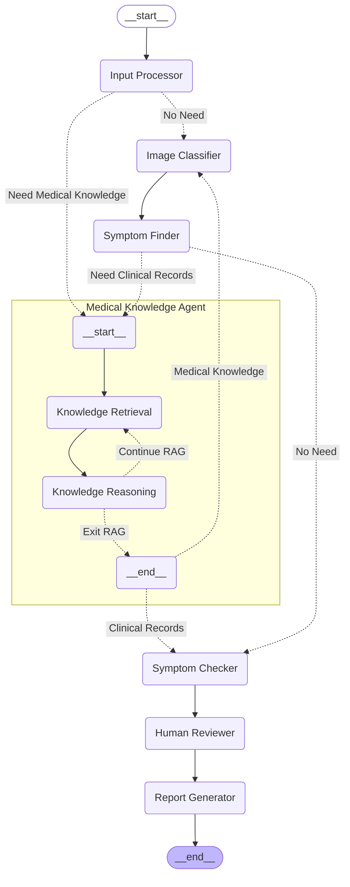

# capstone

```mermaid
graph TD;
        __start__([<p>__start__</p>]):::first
        Input\20Processor(Input Processor)
        Image\20Classifier(Image Classifier)
        Symptom\20Finder(Symptom Finder)
        Human\20Reviewer(Human Reviewer)
        Symptom\20Checker(Symptom Checker)
        Report\20Generator(Report Generator)
        __end__([<p>__end__</p>]):::last
        Human\20Reviewer --> Report\20Generator;
        Image\20Classifier --> Symptom\20Finder;
        Input\20Processor -. &nbsp;No Need&nbsp; .-> Image\20Classifier;
        Input\20Processor -. &nbsp;Need Medical Knowledge&nbsp; .-> Medical\20Knowledge\20Agent\3a__start__;
        Medical\20Knowledge\20Agent\3a__end__ -. &nbsp;Medical Knowledge&nbsp; .-> Image\20Classifier;
        Medical\20Knowledge\20Agent\3a__end__ -. &nbsp;Clinical Records&nbsp; .-> Symptom\20Checker;
        Symptom\20Checker --> Human\20Reviewer;
        Symptom\20Finder -. &nbsp;Need Clinical Records&nbsp; .-> Medical\20Knowledge\20Agent\3a__start__;
        Symptom\20Finder -. &nbsp;No Need&nbsp; .-> Symptom\20Checker;
        __start__ --> Input\20Processor;
        Report\20Generator --> __end__;
        subgraph Medical Knowledge Agent
        Medical\20Knowledge\20Agent\3a__start__(<p>__start__</p>)
        Medical\20Knowledge\20Agent\3aKnowledge\20Retrieval(Knowledge Retrieval)
        Medical\20Knowledge\20Agent\3aKnowledge\20Reasoning(Knowledge Reasoning)
        Medical\20Knowledge\20Agent\3a__end__(<p>__end__</p>)
        Medical\20Knowledge\20Agent\3aKnowledge\20Reasoning -. &nbsp;Continue RAG&nbsp; .-> Medical\20Knowledge\20Agent\3aKnowledge\20Retrieval;
        Medical\20Knowledge\20Agent\3aKnowledge\20Reasoning -. &nbsp;Exit RAG&nbsp; .-> Medical\20Knowledge\20Agent\3a__end__;
        Medical\20Knowledge\20Agent\3aKnowledge\20Retrieval --> Medical\20Knowledge\20Agent\3aKnowledge\20Reasoning;
        Medical\20Knowledge\20Agent\3a__start__ --> Medical\20Knowledge\20Agent\3aKnowledge\20Retrieval;
        end
        classDef default fill:#f2f0ff,line-height:1.2
        classDef first fill-opacity:0
        classDef last fill:#bfb6fc
```